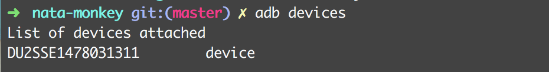
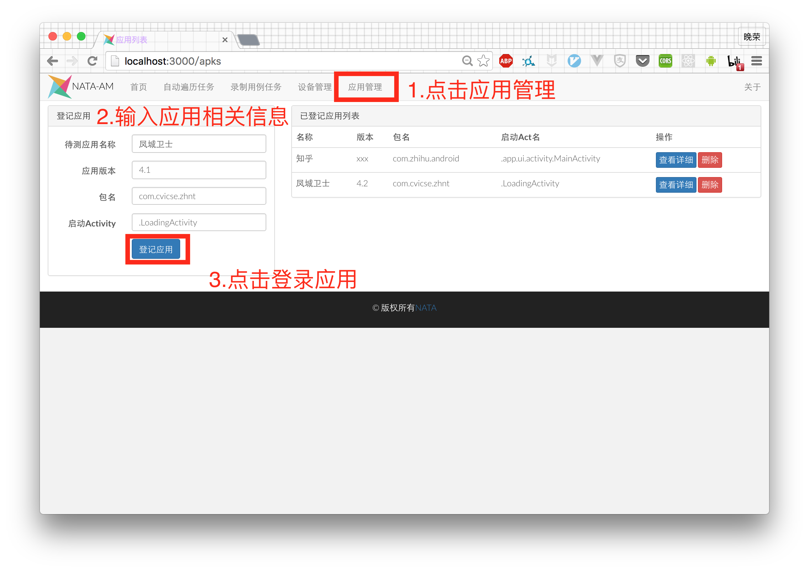
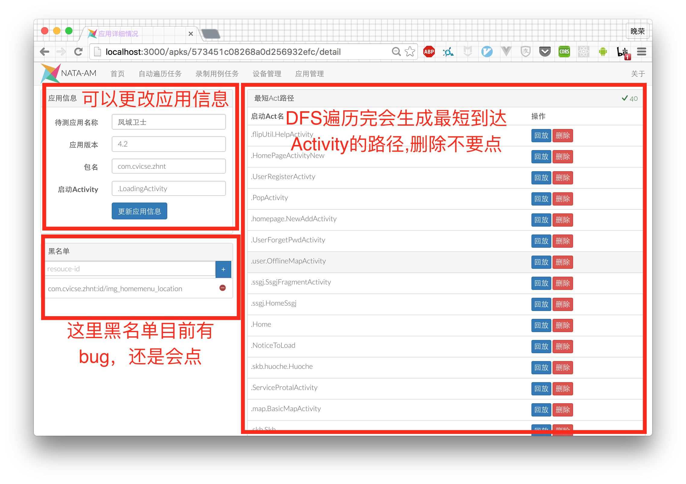
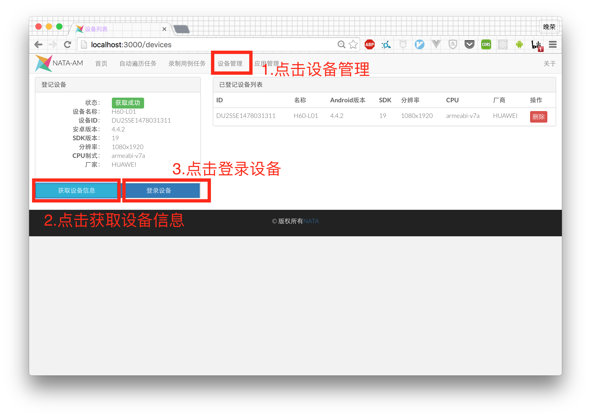
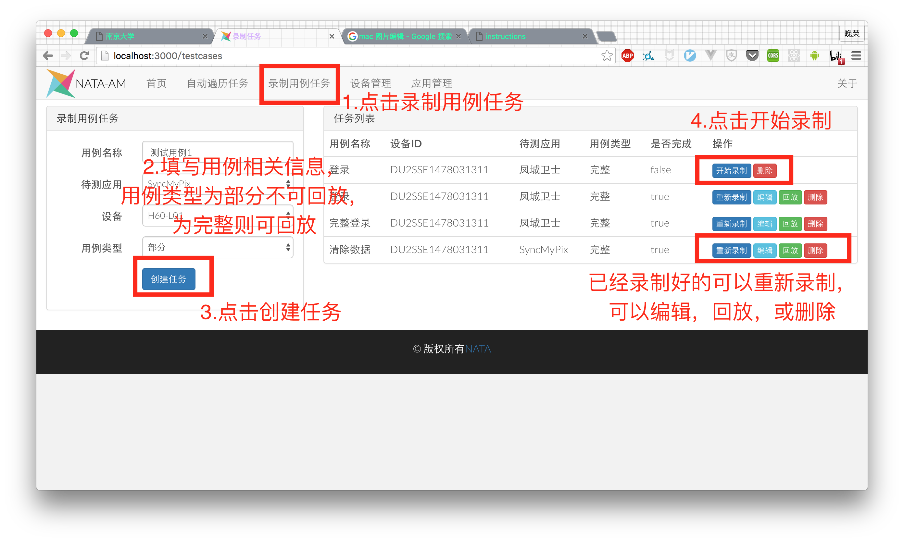
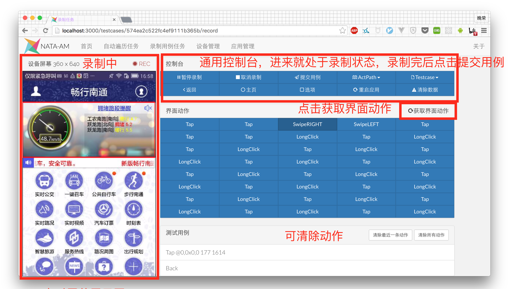
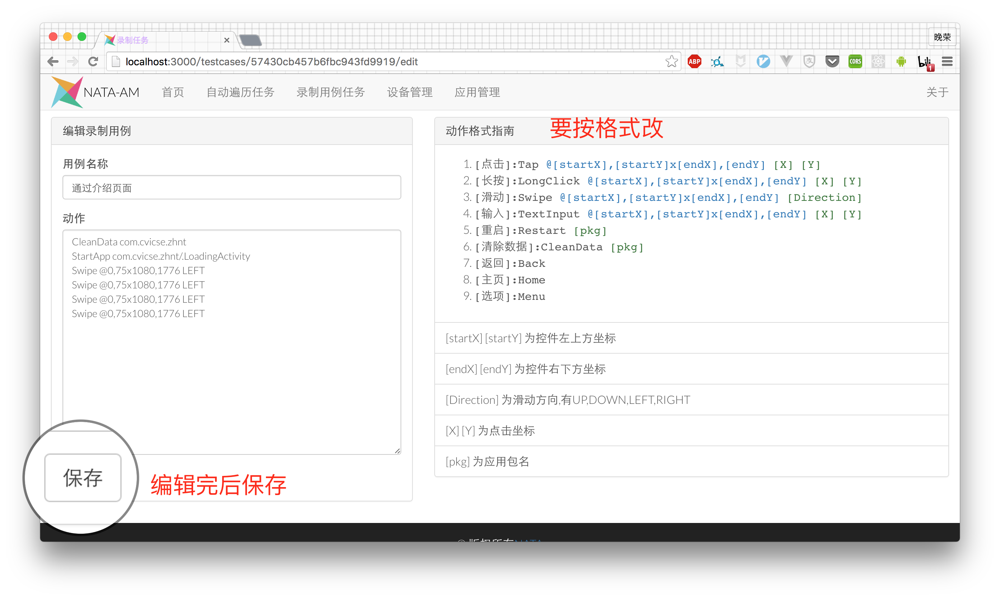
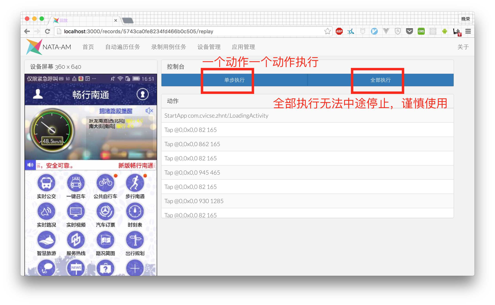
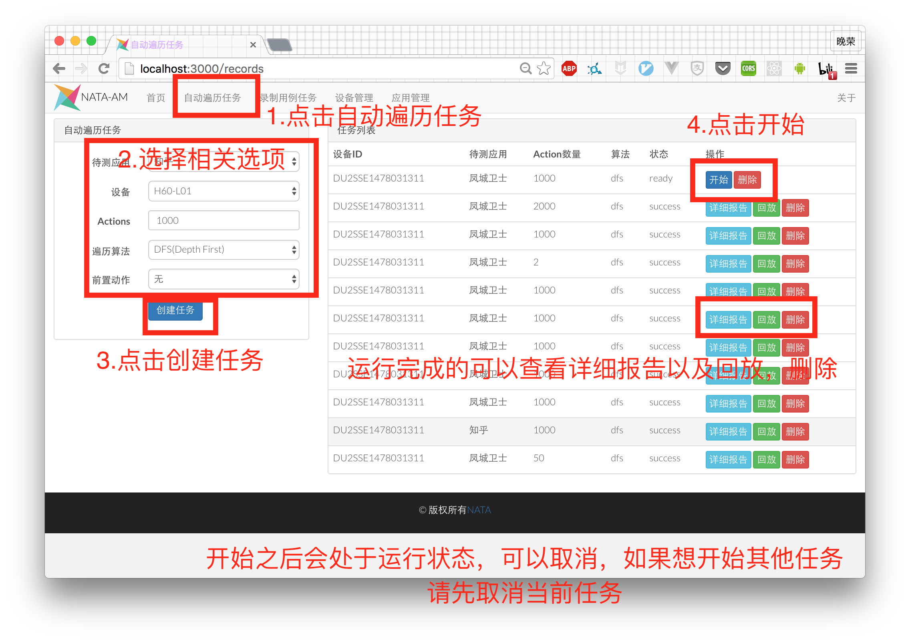
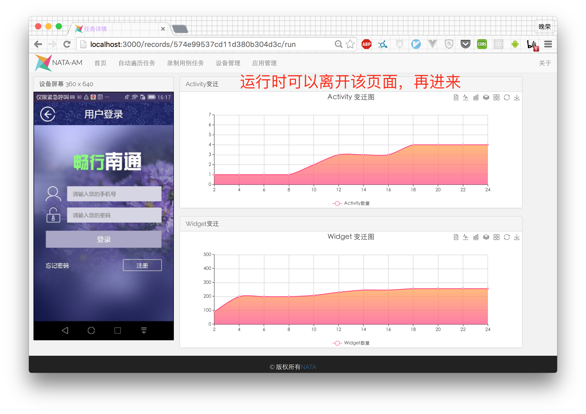

# NataAM(Advanced Monkey for NATA platform)
NataAM is built for automating the process of UI Testing .

# Logo


# 下载nataAm
```
$ git clone git@github.com:open-nata/nataam.git
```

# Nata 启动步骤
### 连接手机
首先插上手机,用`adb devices` 命令查看设备是否已经连上,如果连上是这样的:


### 启动nata-monkey
首先进入`nataam`文件夹
```
$ cd nataam
```
然后我们进入`nata-monkey`文件夹
```
$ cd nata-monkey
```
启动服务
```
$ gradle run
```
然后这个终端就放在那边不要动

### 启动nata-server
新启动一个终端,进入`nataam`文件夹
```
$ cd nataam
```
然后进入`nata-server`文件夹
```
$ cd nata-server
```
启动服务
```
$ ./start.sh
```

### 浏览器使用
打开任意浏览器,在地址栏输入:
```
localhost:3000
```
即可进入应用界面


# NATA 使用步骤

### 应用登记


### 应用管理


### 设备管理


### 创建录制用例任务


### 录制用例


### 编辑测试用例


### 回放


### 创建自动任务


### 查看运行详情
