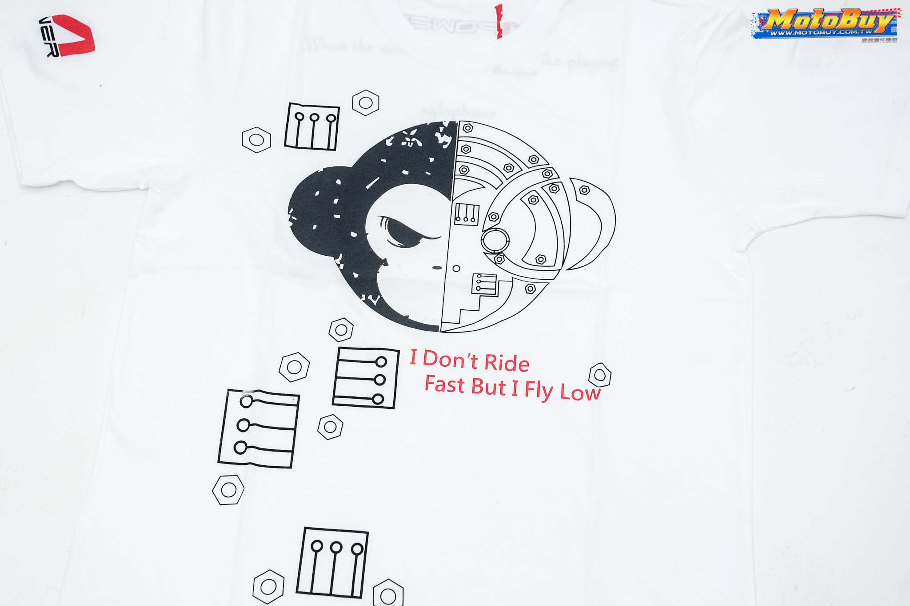

# NataAM(Advanced Monkey for NATA platform)
NataAM is built for automating the process of UI Testing .

# 图标

# 思维导图

# 测试流程

# 运行步骤
-  cd nata-server/minicap &&  nohup ./run.sh -P 1080x1920@360x640/0 >minicap.log 2>&1 & 
- adb forward tcp:1717 localabstract:minicap
- nohup sudo mongod &
- pm2 start ./bin/www
